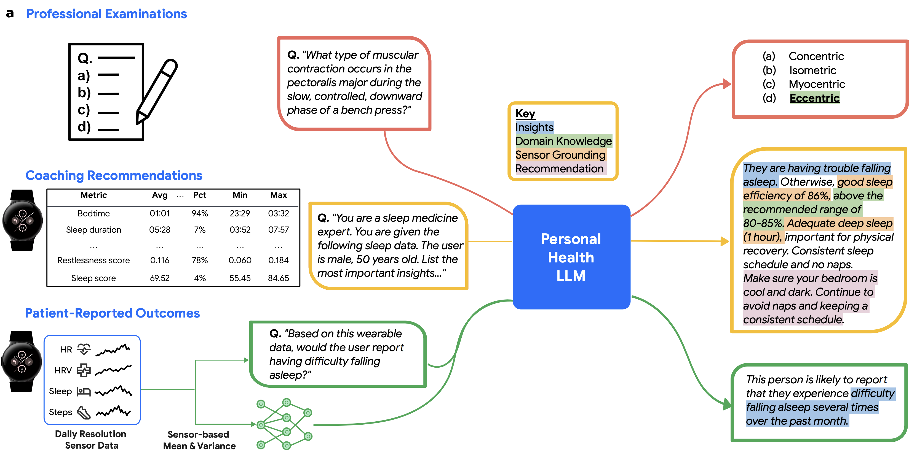

# A Personal Health Large Language Model for Sleep and Fitness Coaching

This repository contains [datasets](#datasets) and [reference code](#reference-code-structure) from the PH-LLM manuscript published in Nature Medicine: "[A personal health large language model for sleep and fitness coaching](https://www.nature.com/articles/s41591-025-03888-0)" ({Khasentino, Belyaeva, Liu, Yang, Furlotte}, et. al, 2025).




> PH-LLM: A Personal Health Large Language Model. Schematic showing the overall experiment design of the study. PH-LLM was evaluated on three aspects of personal health: (i) assessing its level of expert knowledge based on certification examination-style multiple choice questions, (ii) generating personalized insights and recommendations for user goals in the sleep and fitness domains, and (iii) predicting patient-reported outcomes for sleep quality from aggregated daily-resolution numerical sensor data.

## Overview

While large language models (LLMs) show promise for clinical healthcare applications, their utility for personalized health monitoring using wearable device data remains underexplored. Here we introduce the PH-LLM designed for applications in sleep and fitness. PH-LLM is a version of the Gemini LLM that was fine-tuned for text understanding and reasoning when applied to aggregated daily-resolution numerical sensor data. We created three benchmark datasets to assess multiple complementary aspects of sleep and fitness: expert domain knowledge, generation of personalized insights and recommendations, and prediction of self-reported sleep quality from longitudinal data. PH-LLM achieved scores that exceeded a sample of human experts on multiple-choice examinations in sleep medicine (79% vs. 76%) and fitness (88% vs. 71%). In a comprehensive evaluation involving 857 real-world case studies, PH-LLM performed comparably to human experts for fitness-related tasks and improved over the base Gemini model in providing personalized sleep insights. Finally, PH-LLM effectively predicted self-reported sleep quality using a multimodal encoding of wearable sensor data, further demonstrating its ability to effectively contextualize wearable modalities. This work highlights the potential of LLMs to revolutionize personal health monitoring via tailored insights and predictions from wearable data, and provides datasets, rubrics, and benchmark performance to further accelerate personal-health-related LLM research.

## Datasets

We created three benchmark datasets for training and/or evaluating PH-LLM:

1. Coaching recommendations
2. Professional examinations
3. Patient-reported outcomes

Here we provide details for working with open-sourced, anonymized coaching recommendations as well as the processes for accessing professional examinations and patient-reported outcomes. We also detail the evaluation rubrics used by human experts when rating coaching recommendations, AutoEval ratings, and auxiliary data files used to recreate main and extended data figures.

### Coaching recommendations

We have made the anonymized coaching recommendations used to train PH-LLM available for both domains as [`.jsonl`](https://jsonlines.org/) files here:

- Sleep: [sleep_case_studies.all.jsonl](https://github.com/Google-Health/consumer-health-research/blob/main/phllm/data/sleep_case_studies.all.jsonl)
- Fitness: [fitness_case_studies.all.jsonl](https://github.com/Google-Health/consumer-health-research/blob/main/phllm/data/fitness_case_studies.all.jsonl)

Each sleep case study is represented as a single `json` object containing the following keys:

- `vertical`: A string denoting the case study domain; one of `"sleep"` or `"fitness"`.
- `case_study_id`: A unique string identifier denoting the specific case study.
- `user_id`: A unique string identifier denoting the user associated with the case study.
- `input`: A string containing aggregate sensor data and associated metadata that is used as inputs for models or raters.
- `split`: A string denoting the split; one of `"train"`, `"validation"`, `"test"`, `"holdout"`, or `"holdout_model"`.
- `etiology_output`: A string containing the human expert response for the etiology section.
- `insight_output`: A string containing the human expert response for the insights section.
- `recommendation_output`: A string containing the human expert response for the recommendations section.

Each fitness case study is represented as a single `json` object containing the following keys:

- `vertical`: A string denoting the case study domain; one of `"sleep"` or `"fitness"`.
- `case_study_id`: A unique string identifier denoting the specific case study.
- `user_id`: A unique string identifier denoting the user associated with the case study.
- `demographics_input`: A string containing demographics data that is used as inputs for models or raters.
- `health_metrics_input`: A string containing health metrics data that is used as inputs for models or raters.
- `sleep_input`: A string containing sleep data that is used as inputs for models or raters.
- `training_load_input`: A string containing training load data that is used as inputs for models or raters.
- `split`: A string denoting the split; one of `"train"`, `"validation"`, `"test"`, `"holdout"`, or `"holdout_model"`.
- `demographics_output`: A string containing the human expert response for the demographics section.
- `health_metrics_output`: A string containing the human expert response for the health metrics section.
- `muscle_soreness_input`: A string containing the human expert response for the muscle soreness section.
- `readiness_assessment_output`: A string containing the human expert response for the readiness assessment section.
- `sleep_output`: A string containing the human expert response for the sleep section.
- `subjective_readiness_input`: A string containing the human expert response for the subjective readiness section.
- `training_load_output`: A string containing the human expert response for the training load section.

Additionally, we have released an updated version of the fitness case studies with further improvements:

- Fitness: [fitness_case_studies.all.v2.jsonl](https://github.com/Google-Health/consumer-health-research/blob/main/phllm/data/fitness_case_studies.all.v2.jsonl)

These case studies have been revised to improve factual accuracy, for example, with specific corrections made to previously cited numbers and trends.

Case studies were evaluated according to the rubric defined in the paper's Supplementary Table 9.

### Professional examinations

Multiple choice questions (MCQs) for the sleep and fitness domains should be accessed on the corresponding examination websites. In this repository, we provide a small demo CSV file containing synthetic MCQs in the format expected by our reference code implementations: [phllm/data/synthetic_mcq_data.csv](https://github.com/Google-Health/consumer-health-research/blob/main/phllm/data/synthetic_mcq_data.csv). It expects five columns:

- `question`: A string containing the question followed by MCQ options (e.g., `"What shoulder movements and planes of action are involved in a tennis backhand? (A) Adduction/frontal (B) Abduction/frontal (C) Adduction/transverse (D) Abduction/transverse"`).
- `choices`: A JSON object string containing a dictionary mapping each alphanumeric choice (i.e., `"(A)"`) to its corresponding long-form answer (e.g.,`"{'(A)': 'Adduction/frontal', '(B)': 'Abduction/frontal', '(C)': 'Adduction/transverse', '(D)': 'Abduction/transverse'}"`).
- `domain`: A string denoting the target domain; one of `"Sleep"` or `"Fitness"`.
- `difficulty`: An optional string denoting the difficulty of the question; one of `"Easy"`, `"Moderate"`, `"Hard"`, or `None`.
- `answer`: The correct answer (e.g., `"(A)"`).

Note that MCQs were not used for model training–all samples were used in evaluation.

#### Sleep Exams

We compiled 629 multiple choice questions (MCQs) from [BoardVitals](https://www.boardvitals.com) sleep medicine board review question banks. We used the American Medical Association (AMA) Physician's Recognition Award (PRA) "Category 1 - Sleep Medicine'" question bank, which emulates exam content for the American Board of Internal Medicine (ABIM) Sleep Medicine Certification Exam. We also used the Sleep Medicine Maintenance of Certification (MOC) Exam and Longitudinal Knowledge Assessment Review question bank, which emulates exam content for the ABIM Sleep Medicine MOC Exam and ABIM Longitudinal Knowledge Assessment. This compiled set of MCQs spanned a wide range of sleep-related topics: Normal Sleep and Variants (N=127), Breathing Disorders (N=84), Hypersomnolence (N=60), Insomnias (N=85), Movement Disorders (N=23), Parasomnias (N=57), Sleep in Other Disorders (N=112), and Sleep-Wake Timing (N=81).

#### Fitness Exams

We compiled 99 MCQs sourced from multiple question banks that emulate exam content for the Certified Strength and Conditioning Specialists (CSCS) exam [preparation book](https://www.nsca.com/certification/cscs/certified-strength-and-conditioning-specialist-exam-description) that the [National Strength and Conditioning Association (NSCA)](https://ncsf.org/) provides. We used the test exam questions from the NSCA-CSCS textbook "Essentials of Strength Training and Conditioning".

### Patient-reported outcomes

To evaluate the ability of PH-LLM to predict patient-reported outcomes (PROs) from longitudinal passive sensor data, we used a large IRB-approved study in which wearable data was collected for a population of 10,099 consented individuals for a four-week period: [The Google Health Digital Well-Being Study: Protocol for a Digital Device Use and Well-Being Study](https://www.researchprotocols.org/2024/1/e49189/).

All input and target prediction data, which include bucketized age, daily sensor readings for 20 sensors over 15 days, and 16 binary survey responses, for all 4,163 samples in the PRO task are stored in JSON format. To ensure privacy of participants, data used for the PRO task are available to approved researchers for noncommercial research following registration and attestation of a data use agreement. Requests should be made to [google-digital-wellbeing-dataset@google.com](mailto:google-digital-wellbeing-dataset@google.com) and will be evaluated on a weekly basis. Additional details on the exact data format will be made available at time of request approval.

### Auxiliary data

This repository also contains auxiliary data, such as human expert and AutoEval ratings, for reproducing main and extended data figures. Specifically:

- `data/autoeval_ratings/fitness_autoeval_external_ratings.tsv`:AutoEval ratings across PH-LLM and external model responses in the fitness domain (Extended Data Figure 7).
- `data/autoeval_ratings/fitness_autoeval_subsample_ratings.tsv`: AutoEval ratings across subsampled PH-LLM responses in the fitness domain (Extended Data Figure 8).
- `data/autoeval_ratings/fitness_human_expert_ratings.tsv`: Human expert ratings across response sources in the fitness domain (Main Figure 2cd).
- `data/autoeval_ratings/sleep_autoeval_external_ratings.tsv`: AutoEval ratings across PH-LLM and external model responses in the sleep domain (Extended Data Figure 7).
- `data/autoeval_ratings/sleep_autoeval_subsample_ratings.tsv`: AutoEval ratings across subsampled PH-LLM responses in the sleep domain (Extended Data Figure 8).
- `data/autoeval_ratings/sleep_human_expert_ratings.tsv`: Human expert ratings across response sources in the sleep domain (Main Figure 2cd).
- `data/pro_preds_bootstrap.tsv`: Bootstrapped PROs prediction performance metrics across models and targets (Main Figure 3cd).
- `data/pro_prevalence.tsv`: PROs case prevalence across targets.

## Reference Code Structure

- `autoeval`: Contains scripts and reference code for running automated evaluations on the generated case studies.
- `case_studies`: A colab notebook for inspecting and visualizing the case studies that were created.
- `data`: This directory holds all the data files used in our research. See the sections above for details.
- `figures`: A dedicated notebook for generating the manuscript’s main and extended data figures.
- `multimodal`: A colab notebook demonstrating how to implement an LLM multimodal data adapter to process raw wearable sensor data.
- `professional_exams`: A library designed to run MCQ evaluations specifically on professional exams related to sleep and fitness.
- `protos`: Contains the protocol buffer files used for structuring our case study data.

## Dependencies

Reference code dependencies include:

```
absl-py==2.3.1
immutabledict==4.2.1
numpy==2.2.2
pandas==2.2.3
tensorflow==2.18.0
# saxml==0.0.1  # https://github.com/google/saxml
```

All python code was run using [python 3.11](https://www.python.org/downloads/release/python-3110/). Notebooks were run using [Google Colab](https://colab.research.google.com). All code was run on internal Google systems using a custom Linux kernel. Similar SKUs are available on [Google Cloud](https://cloud.google.com). See module-level documentation for details on running each component.

## Citing PH-LLM

If you use PH-LLM datasets or code in your research, please cite the manuscript using:

```
@article{khasentino2025phllm,
author={Khasentino, Justin and Belyaeva, Anastasiya and Liu, Xin and Yang, Zhun and Furlotte, Nicholas A. and Lee, Chace and Schenck, Erik and Patel, Yojan and Cui, Jian and Schneider, Logan Douglas and Bryant, Robby and Gomes, Ryan G. and Jiang, Allen and Lee, Roy and Liu, Yun and Perez, Javier and Rogers, Jameson K. and Speed, Cathy and Tailor, Shyam and Walker, Megan and Yu, Jeffrey and Althoff, Tim and Heneghan, Conor and Hernandez, John and Malhotra, Mark and Stern, Leor and Matias, Yossi and Corrado, Greg S. and Patel, Shwetak and Shetty, Shravya and Zhan, Jiening and Prabhakara, Shruthi and McDuff, Daniel and McLean, Cory Y.},
title={A personal health large language model for sleep and fitness coaching},
journal={Nature Medicine},
year={2025},
month={Aug},
day={14},
issn={1546-170X},
doi={10.1038/s41591-025-03888-0},
url={https://www.nature.com/articles/s41591-025-03888-0}
}
```

## Contributing

For details on contributing to this repository, please see [CONTRIBUTING.md](https://github.com/Google-Health/consumer-health-research/blob/main/CONTRIBUTING.md).
## License

Copyright 2025 Google LLC

Licensed under the Apache License, Version 2.0 (the "License");
you may not use this file except in compliance with the License.
You may obtain a copy of the License at

[https://www.apache.org/licenses/LICENSE-2.0](https://www.apache.org/licenses/LICENSE-2.0)

Unless required by applicable law or agreed to in writing, software
distributed under the License is distributed on an "AS IS" BASIS,
WITHOUT WARRANTIES OR CONDITIONS OF ANY KIND, either express or implied.
See the License for the specific language governing permissions and
limitations under the License.

## Disclaimers

This is not an officially supported Google product. This project is not eligible for the [Google Open Source Software Vulnerability Rewards Program](https://bughunters.google.com/open-source-security). This project is intended for demonstration purposes only. It is not intended for use in a production environment.

NOTE: the content of this research code repository (i) is not intended to be a medical device; and (ii) is not intended for clinical use of any kind, including but not limited to diagnosis or prognosis.
