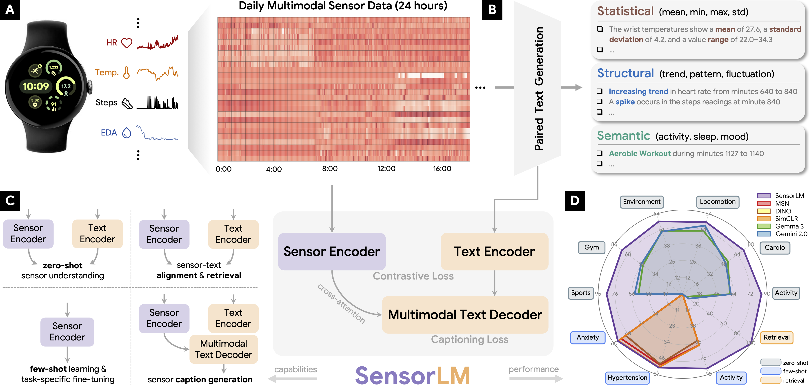

# SensorLM: Learning the Language of Wearable Sensors

This repository contains [datasets](#datasets) and [reference code](#reference-code-structure) from the SensorLM manuscript published in NeurIPS 2025: "[SensorLM: Learning the Language of Wearable Sensors](https://arxiv.org/abs/2506.09108)".




> **Sensor-language foundation models (SensorLM) for wearable data.** Aligning and interpreting sensor data with natural language remains challenging. (A) We present a comprehensive study using over 59.7 million hours of multimodal wearable data from over 103,000 individuals. (B) We design a hierarchical pipeline for automatic paired text generation that covers statistical, structural, and semantic sensor information. (C) The SensorLM pretraining framework and its use cases for diverse downstream tasks. (D) Radar plot comparing the performance of SensorLM and baselines across various tasks and settings.

## Overview

We present SensorLM, a family of sensor-language foundation models that enable wearable sensor data understanding with natural language. Despite its pervasive nature, aligning and interpreting sensor data with language remains challenging due to the lack of paired, richly annotated sensor-text descriptions in uncurated, real-world wearable data. We introduce a hierarchical caption generation pipeline designed to capture statistical, structural, and semantic information from sensor data. This approach enabled the curation of the largest sensor-language dataset to date, comprising over 59.7 million hours of data from more than 103,000 people. Furthermore, SensorLM extends prominent multimodal pretraining architectures (e.g., CLIP, CoCa) and recovers them as specific variants within a generic architecture. Extensive experiments on real-world tasks in human activity analysis and healthcare verify the superior performance of SensorLM over state-of-the-art in zero-shot recognition, few-shot learning, and cross-modal retrieval. SensorLM also demonstrates intriguing capabilities including scaling behaviors, label efficiency, sensor captioning, and zero-shot generalization to unseen tasks.

## Citing SensorLM

If you use SensorLM datasets or code in your research, please cite the manuscript using:

```bib
@inproceedings{zhang2025sensorlm,
    title={SensorLM: Learning the Language of Wearable Sensors},
    author={Yuwei Zhang and Kumar Ayush and Siyuan Qiao and A. Ali Heydari and Girish Narayanswamy and Maxwell A. Xu and Ahmed A. Metwally and Shawn Xu and Jake Garrison and Xuhai Xu and Tim Althoff and Yun Liu and Pushmeet Kohli and Jiening Zhan and Mark Malhotra and Shwetak Patel and Cecilia Mascolo and Xin Liu and Daniel McDuff and Yuzhe Yang},
    booktitle={Conference on Neural Information Processing Systems (NeurIPS)},
    year={2025}
}
```

## Contributing

For details on contributing to this repository, please see [CONTRIBUTING.md](https://github.com/Google-Health/consumer-health-research/blob/main/CONTRIBUTING.md).

## License

Copyright 2025 Google LLC

Licensed under the Apache License, Version 2.0 (the "License");
you may not use this file except in compliance with the License.
You may obtain a copy of the License at

[https://www.apache.org/licenses/LICENSE-2.0](https://www.apache.org/licenses/LICENSE-2.0)

Unless required by applicable law or agreed to in writing, software
distributed under the License is distributed on an "AS IS" BASIS,
WITHOUT WARRANTIES OR CONDITIONS OF ANY KIND, either express or implied.
See the License for the specific language governing permissions and
limitations under the License.

## Disclaimers

This is not an officially supported Google product. This project is not eligible for the [Google Open Source Software Vulnerability Rewards Program](https://bughunters.google.com/open-source-security). This project is intended for demonstration purposes only. It is not intended for use in a production environment.

NOTE: the content of this research code repository (i) is not intended to be a medical device; and (ii) is not intended for clinical use of any kind, including but not limited to diagnosis or prognosis.
